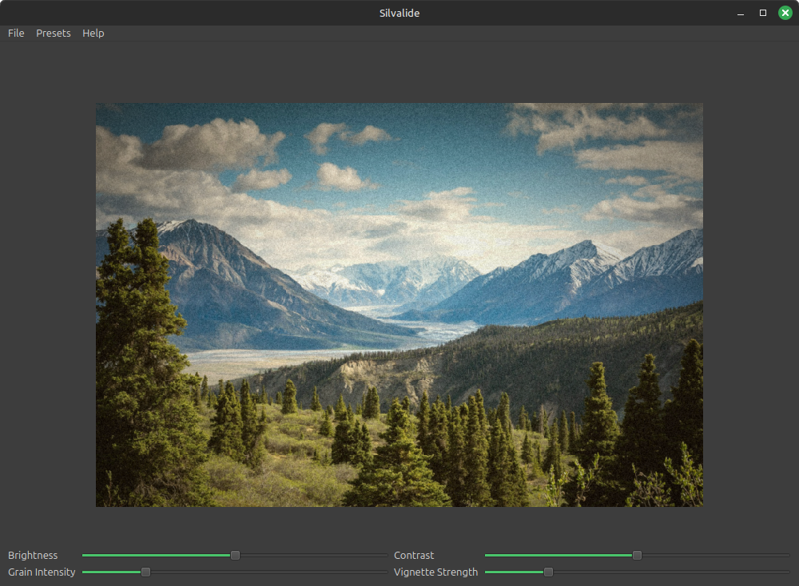

# Silvalide

## About
Silvalide is a program used to emulate the effects of analog film on digital images.
It offers a variety of selectable presets, including options for standard, sepia tone, orthochromatic, and infrared film effects.
Its name comes from the silver halide crystals used in traditional film.

## Roadmap
At present, the program is functional, but lacking in features, customization options, and polish.
Eventually, I may rewrite this program in C++ for easier distribution.
Below is a list of features that I hope to implement on the road to the 1.0 release.

- [x] Add a GUI
- [x] Improve the performance of the Gaussian blur
- [x] Improve the performance of the vignette function
- [x] Rename the project to reflect a more general purpose
- [x] Add additional effects
- [x] Separate code out into multiple files
- [ ] Add a function to apply scratches to image
- [ ] Adjust infrared preset to be smoother
- [ ] Add RAW file support
- [ ] Add a normal black and white preset
- [ ] Add preset manager class
- [ ] Turn the "Film" preset into a warm, cool, and neutral preset
- [ ] Upload examples
- [ ] Improve error handling
- [ ] Improve code comments

## License
Silvalide is released under the MIT License. For more information, see `LICENSE`.
